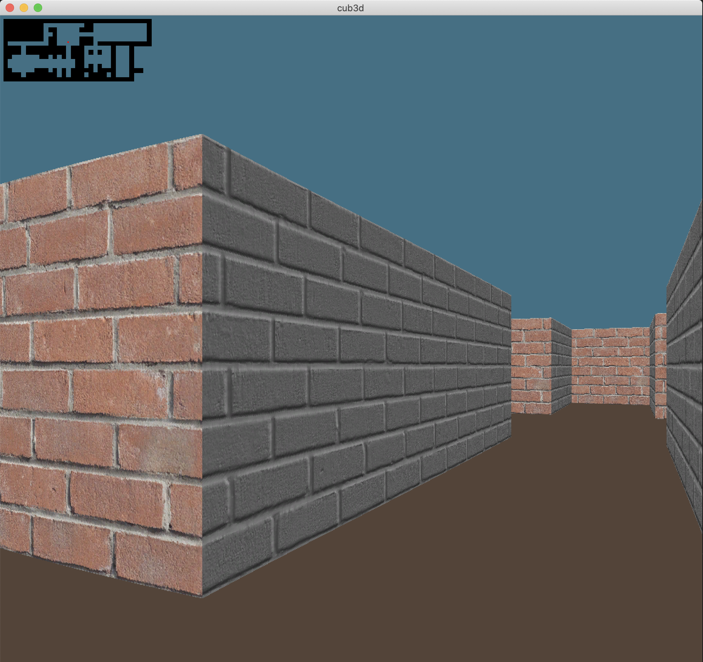

# Cub3D - A 3D Raycasting Engine

Welcome to my Cub3D project! This project is a part of the 42 curriculum, and it's a tribute to the world's first-ever 3D game, Wolfenstein 3D, which was a significant pioneer in the gaming industry.



## Overview

Cub3D is a remarkable 3D engine that uses raycasting techniques, similar to those in Wolfenstein 3D. This project not only showcases the power of simple rendering techniques but also serves as a playground to explore the fundamentals of computer graphics.

## Features

- Full 3D rendering using raycasting techniques
- Texture mapping on walls
- Wall collision detection
- Sprite rendering
- Simple map definition in a file
- Save the first rendered image in bmp format if a second argument is supplied

## Building and Running

To compile the project, navigate to the root of the project directory and run `make`. This will create an executable named `cub3D`.

To run the project, use the following command:

```bash
./cub3D map.cub
